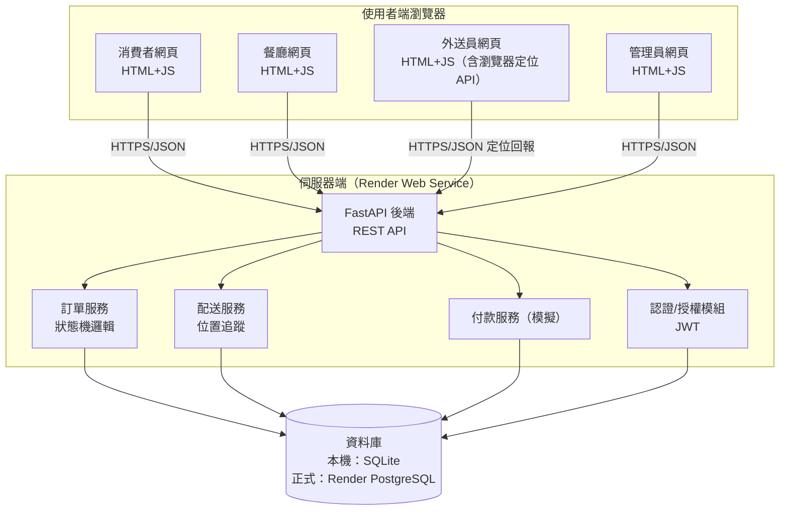
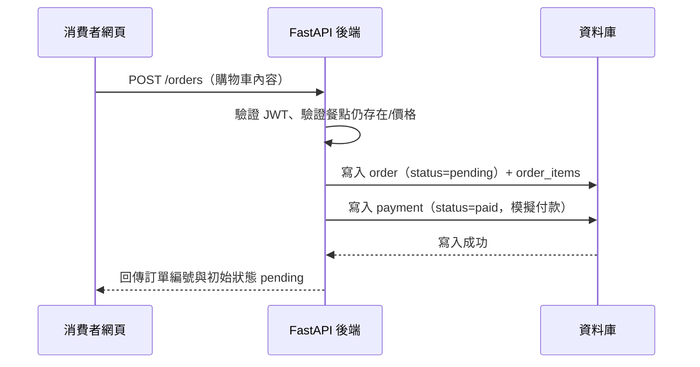
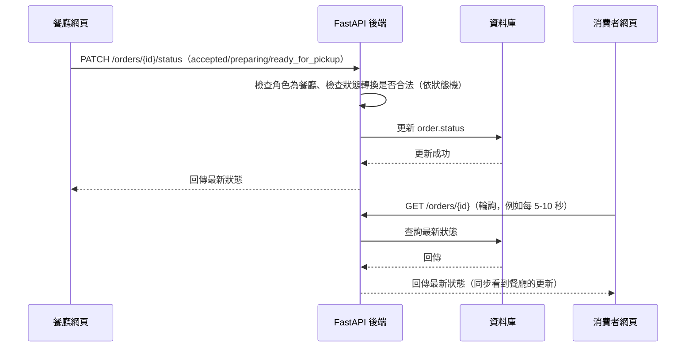
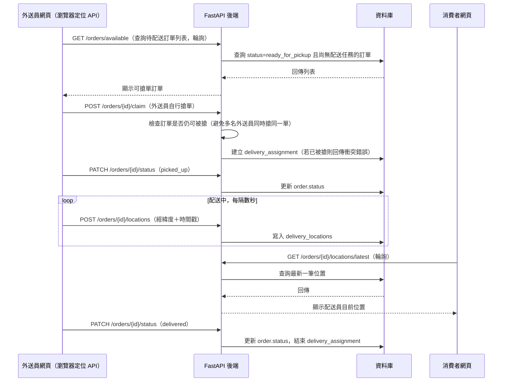

# 架構設計文件｜餐點外送系統

## 1. 系統概述

本架構支撐消費者、餐廳、外送員、管理員四種角色，圍繞「訂單」串起菜單瀏覽、購物車、下單、餐廳出餐、外送即時配送、模擬付款的完整流程。系統採前後端分離的三層架構，後端以 FastAPI 提供 REST API，前端為純 HTML+JS 單頁應用，本機開發使用 SQLite、正式環境部署於 Render 並使用 Render PostgreSQL，目標是用最小複雜度撐起 `/doc/requirements.md` 已核准的訂單狀態機與即時配送位置追蹤需求。

## 2. 系統架構圖

> 消費者端查詢配送位置採**短週期輪詢**（見第 6 節 API 設計與第 7 節技術選型的說明），因此圖中不含獨立的 WebSocket 節點。

## 3. 核心模組職責

| 模組 | 負責 | 不負責 |
|---|---|---|
| 認證/授權模組 | 帳號登入、發放 JWT、角色權限檢查（消費者/餐廳/外送員/管理員） | 不處理業務邏輯，只做身分與權限把關 |
| 菜單模組 | 餐廳資料、餐點分類、餐點 CRUD、餐點庫存/售罄狀態管理 | 不處理訂單或購物車邏輯 |
| 購物車模組 | 消費者購物車項目的新增/修改/刪除；加入購物車與建立訂單前需檢查餐點是否售罄 | 不處理付款 |
| 訂單服務 | 建立訂單、依 `requirements.md` 已核准的狀態機驅動狀態轉換、狀態轉換權限檢查 | 不直接處理定位資料寫入，只在狀態進入 `picked_up`/`delivering` 時開放配送服務寫入 |
| 付款服務（模擬） | 記錄付款子狀態（`unpaid`/`paid`/`refunded`），不串接真實金流 | 不執行任何實際金錢移轉、不對接第三方支付閘道 |
| 配送服務 | 提供待配送訂單列表供外送員自行搶單、建立配送任務（外送員-訂單關聯）、接收並儲存位置回報、提供消費者查詢最新位置與歷史軌跡 | 不做系統自動派單或路徑最佳化（已確認採自行搶單機制） |
| 管理員模組 | 餐廳帳號管理（啟用/停權）、餐點分類管理、營運資料檢視 | 不涉及訂單狀態的直接修改（僅檢視） |
| 前端即時提醒 | 消費者/餐廳/外送員頁面依既有輪詢機制（訂單狀態、配送位置）偵測到資料變化時，於畫面上彈出提示 | 不涉及 Email、簡訊或瀏覽器推播；不需要額外後端通知服務 |

## 4. 資料流

### 4.1 消費者建立訂單

### 4.2 餐廳更新訂單狀態，消費者同步查詢

### 4.3 外送員配送與即時位置追蹤

## 5. 資料庫設計建議（概念層級）

| 實體 | 用途 |
|---|---|
| `users` | 所有角色的帳號資料，含角色欄位（consumer/restaurant/courier/admin） |
| `restaurants` | 餐廳基本資料，關聯到擁有該餐廳的 `users` |
| `menu_categories` | 餐點分類 |
| `menu_items` | 餐點，關聯餐廳與分類；含庫存/售罄狀態欄位 |
| `carts` / `cart_items` | 消費者購物車與項目，關聯 `users` 與 `menu_items` |
| `orders` | 訂單主體，含狀態欄位（依已核准狀態機）、關聯消費者與餐廳 |
| `order_items` | 訂單明細，關聯 `orders` 與 `menu_items`（含下單當下的價格快照） |
| `payments` | 付款子狀態記錄，關聯 `orders`（`unpaid`/`paid`/`refunded`） |
| `delivery_assignments` | 配送任務，關聯外送員與訂單、配送起訖時間 |
| `delivery_locations` | 位置歷史紀錄，關聯 `delivery_assignments`，含經緯度與時間戳 |

詳細欄位、型別、鍵值與驗證規則留給 `data-model-design` skill 具體設計。

## 6. API 設計建議

| 方法 | 路徑 | 用途 | 角色 |
|---|---|---|---|
| POST | `/auth/register` | 註冊一般帳號（消費者／餐廳／外送員；管理員由內部受控流程建立） | 公開 |
| POST | `/auth/login` | 登入取得 JWT | 公開 |
| GET | `/restaurants` | 瀏覽餐廳列表 | 消費者 |
| GET | `/restaurants/{id}/menu` | 瀏覽指定餐廳菜單 | 消費者 |
| POST | `/restaurants` | 建立餐廳（餐廳自行註冊） | 餐廳 |
| POST | `/restaurants/{id}/menu-items` | 新增餐點 | 餐廳 |
| PATCH / DELETE | `/menu-items/{id}` | 修改／下架餐點 | 餐廳 |
| GET / POST / PATCH / DELETE | `/cart` | 購物車查詢與異動 | 消費者 |
| POST | `/orders` | 建立訂單（含模擬付款、下單前檢查餐點是否售罄） | 消費者 |
| GET | `/orders/{id}` | 查詢訂單狀態 | 消費者／餐廳／外送員（依權限） |
| GET | `/orders?role=restaurant` | 餐廳查看待處理訂單列表 | 餐廳 |
| PATCH | `/orders/{id}/status` | 更新訂單狀態（依狀態機規則） | 餐廳／外送員（依狀態不同） |
| GET | `/orders/available` | 查詢可搶單的待配送訂單列表（`ready_for_pickup` 且尚無配送任務） | 外送員 |
| POST | `/orders/{id}/claim` | 外送員自行搶單（建立配送任務，需防止重複搶單） | 外送員 |
| POST | `/orders/{id}/locations` | 外送員回報即時位置 | 外送員 |
| GET | `/orders/{id}/locations/latest` | 查詢最新配送位置 | 消費者 |
| GET | `/orders/{id}/locations` | 查詢配送歷史軌跡 | 消費者／管理員 |
| GET / PATCH | `/admin/restaurants` | 管理餐廳帳號（啟用/停權） | 管理員 |
| GET / POST / PATCH | `/admin/menu-categories` | 管理餐點分類 | 管理員 |

## 7. 技術選型

| 層級 | 技術 | 理由 |
|---|---|---|
| 前端 | 純 HTML + JavaScript | 依需求文件限制，不使用框架，降低學習門檻 |
| 後端 | FastAPI | 依需求文件指定，型別提示佳、自帶 OpenAPI 文件（`/docs`），利於教學驗證 |
| 認證 | JWT（存於瀏覽器 localStorage，透過 Authorization Header 傳遞） | 純 HTML+JS 前端無伺服器端 session 機制，JWT 是最簡單可行的無狀態方案 |
| 本機資料庫 | SQLite | 依需求文件指定，免安裝、單檔案 |
| 正式資料庫 | Render PostgreSQL | 依需求文件指定 |
| 即時位置傳輸 | **短週期輪詢（REST，例如每 5-10 秒查詢一次）**，非 WebSocket | 教學情境優先考量實作簡單度與 Render 免費方案相容性；WebSocket 需額外處理連線管理、Render 免費方案的閒置行為，複雜度顯著提高。此為架構階段的技術選型決策，若未來效能或即時性要求提高，可替換為 WebSocket，屬可延後的優化項 |
| 定位資料來源 | 外送員瀏覽器 [Geolocation API](https://developer.mozilla.org/docs/Web/API/Geolocation_API) | 前端純 HTML+JS 可直接呼叫，不需額外原生 App |
| 地圖視覺化 | OpenStreetMap 圖資 + Leaflet.js（開源前端地圖套件） | 免費、不需第三方地圖 API 金鑰與費用，純 HTML+JS 前端可直接引入 |
| 即時提醒 | 沿用既有輪詢機制（無獨立通知模組） | 已確認僅需「網頁內即時提醒」，前端偵測輪詢結果變化時於畫面顯示提示即可，不需 Email/簡訊/推播基礎設施 |

## 8. 安全性

- 密碼一律以雜湊（如 bcrypt）儲存，不得明碼落地。
- 所有機密資訊（JWT 密鑰、資料庫連線字串）透過環境變數管理，不寫死於程式碼或提交至 Git（將於 `dev-standards` skill 具體規範 `.env`／`.gitignore`）。
- API 端點依角色做授權檢查：例如訂單狀態轉換需檢查操作者角色與目前狀態是否允許此轉換（依已核准狀態機），防止消費者直接把訂單改成 `delivered`。
- 輸入驗證：FastAPI 搭配 Pydantic 模型做請求資料驗證，避免不合法資料寫入資料庫。
- 位置資料屬敏感個資範疇，僅開放給該訂單相關的消費者／餐廳／管理員查詢，不對外公開。

### 效能考量（小規模正式上線，同時在線約數百人）

- 資料庫需為高頻查詢欄位建立索引：`orders.status`、`orders.consumer_id`、`orders.restaurant_id`、`delivery_locations.delivery_assignment_id`＋時間戳、`menu_items.restaurant_id`。
- 訂單列表、菜單列表等查詢須避免 N+1（例如一次查詢訂單時附帶查詢每筆訂單的品項，應用 JOIN 或批次查詢取代迴圈內查詢）。
- 資料庫連線使用連線池（FastAPI 常見作法：搭配 SQLAlchemy 的 connection pool 設定），避免每個請求都重新建立連線。
- 目前規模（數百人同時在線）不需要快取層（如 Redis）、不需要負載平衡或水平擴展多台伺服器，Render 免費/入門付費方案即可支撐，但需留意 Render 免費方案的閒置休眠特性可能影響輪詢即時性（見部署方式章節）。

## 9. 部署方式

- **本機開發**：FastAPI 搭配 SQLite，`uvicorn main:app --reload` 啟動；前端為靜態檔案，可由 FastAPI 直接掛載或以簡單靜態伺服器提供。
- **正式部署**：推送至 GitHub → Render Web Service 讀取 `render.yaml` 或手動設定 Build/Start Command → 環境變數設定 `DATABASE_URL` 指向 Render PostgreSQL Internal Database URL → 部署完成後透過 Render 提供的網域對外存取。
- 本機與正式環境的資料庫連線切換透過環境變數（如 `DATABASE_URL` 是否存在）判斷，避免程式碼寫死連線邏輯。

## 10. 待確認事項

- 即時位置輪詢的確切秒數尚未拍板，架構建議 5-10 秒，將於資料模型/開發階段依實測結果微調。
- 是否需要多語系支援？需求文件標示預設不需要，此架構未設計對應機制，如需要請另行補充需求。
- 具體時程與預算限制需求文件未提及，暫不列入設計考量。
- 外送員搶單發生同時搶同一筆訂單的競態情況，架構已在 `POST /orders/{id}/claim` 標示需做衝突檢查，但具體的資料庫層級鎖定機制（如樂觀鎖／唯一約束）留給 `data-model-design` skill 具體設計。
