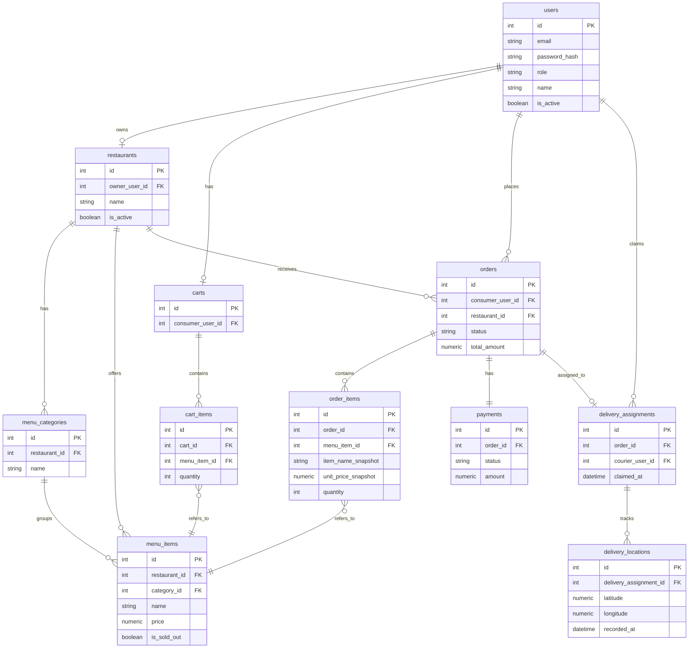

# 資料模型文件｜餐點外送系統

依據 `/doc/requirements.md`（訂單狀態機、已確認決策）與 `/doc/architecture.md`（模組職責、API 設計）設計。本機開發使用 SQLite，正式環境使用 PostgreSQL；型別差異已於各欄位標註。

## 1. 核心實體總覽

| 實體 | 用途 |
|---|---|
| `users` | 所有角色（消費者/餐廳/外送員/管理員）的帳號資料 |
| `restaurants` | 餐廳基本資料 |
| `menu_categories` | 餐點分類 |
| `menu_items` | 餐點，含價格與售罄狀態 |
| `carts` | 消費者購物車 |
| `cart_items` | 購物車內的品項 |
| `orders` | 訂單主體，含狀態機狀態 |
| `order_items` | 訂單明細（含下單當下的價格快照） |
| `payments` | 模擬付款紀錄 |
| `delivery_assignments` | 配送任務（外送員與訂單的配對） |
| `delivery_locations` | 配送位置歷史紀錄 |

## 2. 各實體詳細定義

### `users`

| 欄位 | 型別 | 必填 | 預設值 | 說明 |
|---|---|---|---|---|
| `id` | INTEGER (SQLite) / SERIAL (Postgres) | 是 | 自動遞增 | 主鍵 |
| `email` | TEXT / VARCHAR(255) | 是 | 無 | 登入帳號，唯一 |
| `password_hash` | TEXT / VARCHAR(255) | 是 | 無 | 雜湊後密碼，見第 7 節 |
| `role` | TEXT / VARCHAR(20) | 是 | 無 | 列舉：`consumer`／`restaurant`／`courier`／`admin` |
| `name` | TEXT / VARCHAR(100) | 是 | 無 | 顯示名稱 |
| `phone` | TEXT / VARCHAR(20) | 否 | NULL | 聯絡電話 |
| `is_active` | BOOLEAN | 是 | `TRUE` | 帳號是否可登入（管理員可停權） |
| `created_at` | DATETIME / TIMESTAMPTZ | 是 | 建立當下 | 建立時間 |
| `updated_at` | DATETIME / TIMESTAMPTZ | 是 | 建立當下，異動時更新 | 最後更新時間 |

主鍵：`id`。唯一約束：`email`。

### `restaurants`

| 欄位 | 型別 | 必填 | 預設值 | 說明 |
|---|---|---|---|---|
| `id` | INTEGER / SERIAL | 是 | 自動遞增 | 主鍵 |
| `owner_user_id` | INTEGER / INTEGER | 是 | 無 | 外鍵 → `users.id`（`role='restaurant'`） |
| `name` | TEXT / VARCHAR(100) | 是 | 無 | 餐廳名稱 |
| `description` | TEXT | 否 | NULL | 餐廳簡介 |
| `address` | TEXT | 否 | NULL | 地址 |
| `phone` | TEXT / VARCHAR(20) | 否 | NULL | 聯絡電話 |
| `is_active` | BOOLEAN | 是 | `TRUE` | 需求已確認：餐廳自行註冊即可用，此欄位供管理員後續停權使用 |
| `created_at` | DATETIME / TIMESTAMPTZ | 是 | 建立當下 | |
| `updated_at` | DATETIME / TIMESTAMPTZ | 是 | 建立當下 | |

主鍵：`id`。外鍵：`owner_user_id` → `users.id`。

### `menu_categories`

| 欄位 | 型別 | 必填 | 預設值 | 說明 |
|---|---|---|---|---|
| `id` | INTEGER / SERIAL | 是 | 自動遞增 | 主鍵 |
| `restaurant_id` | INTEGER / INTEGER | 是 | 無 | 外鍵 → `restaurants.id` |
| `name` | TEXT / VARCHAR(50) | 是 | 無 | 分類名稱 |
| `sort_order` | INTEGER | 否 | `0` | 顯示排序 |

主鍵：`id`。外鍵：`restaurant_id` → `restaurants.id`。

### `menu_items`

| 欄位 | 型別 | 必填 | 預設值 | 說明 |
|---|---|---|---|---|
| `id` | INTEGER / SERIAL | 是 | 自動遞增 | 主鍵 |
| `restaurant_id` | INTEGER / INTEGER | 是 | 無 | 外鍵 → `restaurants.id` |
| `category_id` | INTEGER / INTEGER | 否 | NULL | 外鍵 → `menu_categories.id`（允許未分類） |
| `name` | TEXT / VARCHAR(100) | 是 | 無 | 餐點名稱 |
| `description` | TEXT | 否 | NULL | 餐點說明 |
| `price` | NUMERIC(10,2) | 是 | 無 | 價格；SQLite 以 `NUMERIC` 儲存但實際依浮點/整數分處理，建議以「分」為單位存整數，或應用層以 `Decimal` 處理避免浮點誤差 |
| `is_sold_out` | BOOLEAN | 是 | `FALSE` | 已確認需求：售罄狀態，`TRUE` 時消費者不可加入購物車/下單 |
| `created_at` | DATETIME / TIMESTAMPTZ | 是 | 建立當下 | |
| `updated_at` | DATETIME / TIMESTAMPTZ | 是 | 建立當下 | |

主鍵：`id`。外鍵：`restaurant_id` → `restaurants.id`；`category_id` → `menu_categories.id`。

### `carts`

| 欄位 | 型別 | 必填 | 預設值 | 說明 |
|---|---|---|---|---|
| `id` | INTEGER / SERIAL | 是 | 自動遞增 | 主鍵 |
| `consumer_user_id` | INTEGER / INTEGER | 是 | 無 | 外鍵 → `users.id`（`role='consumer'`），唯一 |
| `created_at` | DATETIME / TIMESTAMPTZ | 是 | 建立當下 | |
| `updated_at` | DATETIME / TIMESTAMPTZ | 是 | 建立當下 | |

主鍵：`id`。外鍵＋唯一約束：`consumer_user_id`（每位消費者僅一個購物車，見第 8 節待確認事項——是否允許多餐廳混合購物車）。

### `cart_items`

| 欄位 | 型別 | 必填 | 預設值 | 說明 |
|---|---|---|---|---|
| `id` | INTEGER / SERIAL | 是 | 自動遞增 | 主鍵 |
| `cart_id` | INTEGER / INTEGER | 是 | 無 | 外鍵 → `carts.id` |
| `menu_item_id` | INTEGER / INTEGER | 是 | 無 | 外鍵 → `menu_items.id` |
| `quantity` | INTEGER | 是 | `1` | 數量，須 ≥ 1 |
| `created_at` | DATETIME / TIMESTAMPTZ | 是 | 建立當下 | |

主鍵：`id`。外鍵：`cart_id` → `carts.id`；`menu_item_id` → `menu_items.id`。唯一約束：`(cart_id, menu_item_id)`（同一餐點在購物車中只會有一筆，數量用 `quantity` 累加，不重複插入）。

### `orders`

| 欄位 | 型別 | 必填 | 預設值 | 說明 |
|---|---|---|---|---|
| `id` | INTEGER / SERIAL | 是 | 自動遞增 | 主鍵 |
| `consumer_user_id` | INTEGER / INTEGER | 是 | 無 | 外鍵 → `users.id` |
| `restaurant_id` | INTEGER / INTEGER | 是 | 無 | 外鍵 → `restaurants.id` |
| `status` | TEXT / VARCHAR(20) | 是 | `'pending'` | 依 requirements.md 已核准狀態機：`pending`／`accepted`／`rejected`／`preparing`／`ready_for_pickup`／`picked_up`／`delivering`／`delivered`／`completed`／`cancelled` |
| `total_amount` | NUMERIC(10,2) | 是 | 無 | 訂單總金額（下單當下計算並固定） |
| `created_at` | DATETIME / TIMESTAMPTZ | 是 | 建立當下 | |
| `updated_at` | DATETIME / TIMESTAMPTZ | 是 | 建立當下，狀態變更時更新 | |

主鍵：`id`。外鍵：`consumer_user_id` → `users.id`；`restaurant_id` → `restaurants.id`。

### `order_items`

| 欄位 | 型別 | 必填 | 預設值 | 說明 |
|---|---|---|---|---|
| `id` | INTEGER / SERIAL | 是 | 自動遞增 | 主鍵 |
| `order_id` | INTEGER / INTEGER | 是 | 無 | 外鍵 → `orders.id` |
| `menu_item_id` | INTEGER / INTEGER | 是 | 無 | 外鍵 → `menu_items.id`（供追溯，餐點本身可能之後被修改/下架） |
| `item_name_snapshot` | TEXT / VARCHAR(100) | 是 | 無 | 下單當下的餐點名稱快照 |
| `unit_price_snapshot` | NUMERIC(10,2) | 是 | 無 | 下單當下的單價快照 |
| `quantity` | INTEGER | 是 | 無 | 數量，須 ≥ 1 |
| `subtotal` | NUMERIC(10,2) | 是 | 無 | `unit_price_snapshot * quantity` |

主鍵：`id`。外鍵：`order_id` → `orders.id`；`menu_item_id` → `menu_items.id`。

> 保留價格/名稱快照是為了避免餐廳事後修改餐點價格/名稱，導致歷史訂單金額顯示錯誤。

### `payments`

| 欄位 | 型別 | 必填 | 預設值 | 說明 |
|---|---|---|---|---|
| `id` | INTEGER / SERIAL | 是 | 自動遞增 | 主鍵 |
| `order_id` | INTEGER / INTEGER | 是 | 無 | 外鍵 → `orders.id`，唯一（一筆訂單一筆付款紀錄） |
| `status` | TEXT / VARCHAR(20) | 是 | `'unpaid'` | 依 requirements.md 已核准：`unpaid`／`paid`／`refunded` |
| `amount` | NUMERIC(10,2) | 是 | 無 | 應與 `orders.total_amount` 一致 |
| `paid_at` | DATETIME / TIMESTAMPTZ | 否 | NULL | 模擬付款完成時間 |
| `refunded_at` | DATETIME / TIMESTAMPTZ | 否 | NULL | 模擬退款時間 |

主鍵：`id`。外鍵＋唯一約束：`order_id` → `orders.id`。

### `delivery_assignments`

| 欄位 | 型別 | 必填 | 預設值 | 說明 |
|---|---|---|---|---|
| `id` | INTEGER / SERIAL | 是 | 自動遞增 | 主鍵 |
| `order_id` | INTEGER / INTEGER | 是 | 無 | 外鍵 → `orders.id`，唯一 |
| `courier_user_id` | INTEGER / INTEGER | 是 | 無 | 外鍵 → `users.id`（`role='courier'`） |
| `claimed_at` | DATETIME / TIMESTAMPTZ | 是 | 建立當下 | 外送員搶單時間 |
| `picked_up_at` | DATETIME / TIMESTAMPTZ | 否 | NULL | 取餐時間 |
| `delivered_at` | DATETIME / TIMESTAMPTZ | 否 | NULL | 送達時間 |

主鍵：`id`。外鍵：`order_id` → `orders.id`；`courier_user_id` → `users.id`。**唯一約束：`order_id`**——這是防止多名外送員同時搶同一筆訂單的關鍵設計：`POST /orders/{id}/claim` 在資料庫層級對 `order_id` 做唯一約束插入，第二個搶單請求會因違反唯一約束而失敗，應用層攔截此錯誤並回傳「訂單已被搶」，不需要額外的樂觀鎖版本欄位。

### `delivery_locations`

| 欄位 | 型別 | 必填 | 預設值 | 說明 |
|---|---|---|---|---|
| `id` | INTEGER / SERIAL | 是 | 自動遞增 | 主鍵 |
| `delivery_assignment_id` | INTEGER / INTEGER | 是 | 無 | 外鍵 → `delivery_assignments.id` |
| `latitude` | NUMERIC(9,6) | 是 | 無 | 緯度 |
| `longitude` | NUMERIC(9,6) | 是 | 無 | 經度 |
| `recorded_at` | DATETIME / TIMESTAMPTZ | 是 | 建立當下 | 該筆定位回報的時間 |

主鍵：`id`。外鍵：`delivery_assignment_id` → `delivery_assignments.id`。

## 3. 實體關聯

- `users` 1 — 0..1 `restaurants`（一位餐廳角色使用者對應一間餐廳，簡化為 1:1；若需一帳號管理多間餐廳，屬待確認事項）
- `restaurants` 1 — N `menu_categories`
- `restaurants` 1 — N `menu_items`；`menu_categories` 1 — N `menu_items`
- `users`（消費者）1 — 1 `carts`；`carts` 1 — N `cart_items`；`cart_items` N — 1 `menu_items`
- `users`（消費者）1 — N `orders`；`restaurants` 1 — N `orders`
- `orders` 1 — N `order_items`；`order_items` N — 1 `menu_items`
- `orders` 1 — 1 `payments`
- `orders` 1 — 0..1 `delivery_assignments`；`users`（外送員）1 — N `delivery_assignments`
- `delivery_assignments` 1 — N `delivery_locations`

## 4. 資料驗證規則

- `users.email`：需符合 email 格式，唯一，不可重複註冊。
- `users.role`：資料層僅允許 `consumer`／`restaurant`／`courier`／`admin` 四種值；公開註冊 API 僅接受前三種，`admin` 須由受控的內部建置流程建立。
- `menu_items.price`、`orders.total_amount`、`order_items.unit_price_snapshot`／`subtotal`、`payments.amount`：須 ≥ 0。
- `cart_items.quantity`、`order_items.quantity`：須 ≥ 1（整數）。
- 建立訂單時（跨欄位規則）：`order_items` 加總金額須等於 `orders.total_amount`；每筆 `order_items` 對應的 `menu_items.is_sold_out` 須為 `FALSE`，否則不可下單（已確認的庫存/售罄規則）。
- `orders.status` 轉換須遵循 requirements.md 已核准的狀態機，不可跳躍轉換（例如不可從 `pending` 直接跳到 `delivering`），此規則應在應用層（`OrderSvc`）強制檢查，資料庫層僅用 CHECK 約束限制合法列舉值。
- `delivery_assignments`：同一 `order_id` 只能有一筆紀錄（唯一約束防止重複搶單，見第 2 節）。
- `payments.status` 轉換：僅允許 `unpaid → paid`、`paid → refunded`，不可逆向或跳躍。

## 5. 索引建議

（呼應 architecture.md 效能考量章節的數百人同時在線目標）

| 欄位 | 原因 |
|---|---|
| `orders.status` | 餐廳查詢待處理訂單、外送員查詢可搶單訂單皆依狀態篩選 |
| `orders.consumer_user_id` | 消費者查詢自己的歷史訂單 |
| `orders.restaurant_id` | 餐廳查詢自己收到的訂單 |
| `menu_items.restaurant_id` | 瀏覽餐廳菜單時的主要查詢條件 |
| `delivery_locations.(delivery_assignment_id, recorded_at)` | 查詢最新位置／歷史軌跡皆依此排序查詢，建議複合索引 |
| `delivery_assignments.courier_user_id` | 外送員查詢自己正在配送的任務 |
| `users.email` | 已因唯一約束自動建立索引，登入查詢受益 |

## 6. 資料生命週期

- 所有實體採**硬刪除或軟刪除**尚未確認（見第 8 節），目前設計預設不刪除歷史紀錄（訂單、付款、配送紀錄皆保留），僅 `users.is_active`／`restaurants.is_active` 用狀態欄位表示「停用」而非刪除列。
- `orders`／`payments`／`delivery_assignments`／`delivery_locations`：一旦建立即保留，不因訂單完成或取消而刪除，作為歷史紀錄與稽核依據。
- `cart_items`：訂單建立成功後，應清空對應的購物車項目（避免重複下單同一批品項），此為應用層行為，非資料庫層自動清除。
- 無資料保留期限規範（requirements.md 未提及），暫不設計自動清除機制。

## 7. 敏感資料處理方式

- `users.password_hash`：**絕不明碼儲存**，須以 bcrypt 或同等強度雜湊演算法處理，資料庫僅存雜湊值。
- `users.email`／`phone`：屬個資，API 回傳時僅回傳給本人或有權限的管理員，不對外公開列表。
- `delivery_locations`（經緯度）：屬敏感個資（可推斷外送員即時位置），依 architecture.md 已規範僅開放給該訂單相關的消費者／餐廳／管理員查詢。
- `payments`：本系統為模擬付款，不儲存信用卡卡號等真實金流敏感資訊；若未來串接真實金流，需另行設計（如僅存金流服務回傳的 token，不落地卡號）。

## 8. 待確認事項

- 一位餐廳角色使用者是否只能對應一間餐廳？目前設計為 1:1 簡化假設，若需支援連鎖餐廳（一帳號管理多分店）需調整 `restaurants` 與 `users` 的關聯設計。
- 是否需要軟刪除機制（如餐點下架是否為刪除列或標記 `is_active=FALSE`）？目前 `menu_items` 設計未包含 `is_active` 欄位，若下架需求是「消費者看不到但歷史訂單仍需顯示」，建議補上 `is_active` 欄位而非直接刪除列（避免破壞 `order_items` 的外鍵參照）。
- 購物車是否允許同時放入多間餐廳的餐點，或加入不同餐廳餐點時需清空原購物車？需求文件未明確定義，此點會影響下單時是否需要拆單。
- 價格金額的資料型別，SQLite 與 PostgreSQL 皆支援 `NUMERIC`，但實際專案若使用 ORM（如 SQLAlchemy），需確認 ORM 對應型別是否正確避免浮點誤差，屬開發階段需驗證的技術細節。

## 9. 實體關聯圖

