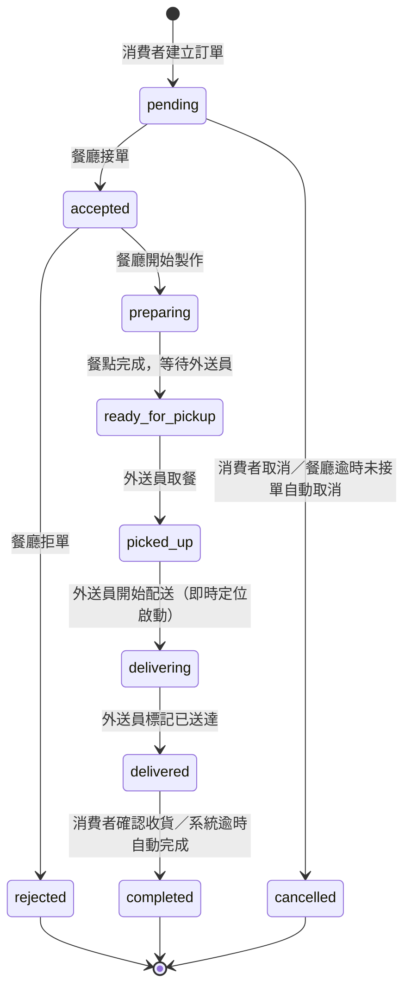

# 需求規格書｜餐點外送系統

## 專案概述

建立一個餐點外送系統，讓消費者能瀏覽餐廳與餐點、加入購物車、建立訂單並查看訂單狀態；餐廳能上架管理菜單並接單出餐；管理員能治理平台（餐廳帳號、餐點分類與整體營運資料）。系統需完整跑通「消費者下單 → 餐廳更新狀態 → 消費者查詢」的核心流程，並部署到公開可存取的正式環境。

## 使用者角色與各角色目標

| 角色 | 主要目標 |
|---|---|
| 消費者 | 瀏覽餐廳與餐點、加入購物車、建立訂單、查看訂單狀態 |
| 餐廳 | 上架管理菜單（新增／修改／下架餐點）、接收訂單、更新訂單狀態（出餐流程） |
| 管理員 | 平台治理：管理餐廳帳號、管理餐點分類、掌握整體營運資料 |

## 核心功能需求（依優先級排序）

### 高優先（MVP 必須有）

1. 消費者瀏覽餐廳與餐點列表
2. 消費者建立與管理購物車
3. 消費者建立訂單
4. 消費者查詢訂單狀態
5. 餐廳接單並更新訂單狀態，消費者端可同步查到最新狀態
6. 管理員管理餐廳帳號與餐點分類

### 中優先（MVP 範圍內，但實作順序在核心下單流程之後）

7. 付款：**採模擬付款狀態**（記錄「已付款／未付款」，不串接真實第三方金流、不實際扣款）
8. 外送員角色與配送狀態追蹤：**需即時位置追蹤**（配送員回報/更新即時位置，消費者可查看配送中位置，非僅簡單狀態欄位）

> 訪談中使用者將付款與外送員角色都勾選為 MVP 範圍，但依系統複雜度，建議實作順序仍是：核心下單流程 → 餐廳/管理員管理功能 → 付款 → 外送員配送追蹤（含即時定位）。此順序調整將在架構設計與待辦清單階段具體排列，此處先如實記錄使用者原始優先級選擇。
>
> 注意：即時位置追蹤在架構上需要額外考量（定位資料來源、更新頻率、地圖顯示、資料庫寫入負載），複雜度明顯高於一般 CRUD 功能，將於架構設計階段具體評估技術方案。

## 需保存的核心資料項目（概念層級）

- 使用者帳號（消費者／餐廳／管理員／外送員，含角色區分）
- 餐廳資料
- 餐點（含分類、庫存/售罄狀態）
- 購物車與購物車項目
- 訂單與訂單項目
- 訂單狀態歷程
- 付款/金流紀錄（模擬付款，狀態層級）
- 外送員與配送狀態紀錄、配送位置歷史

## 限制條件

- 技術棧：沿用課程慣例——後端 FastAPI、前端純 HTML + JavaScript（不使用 React/Vue 等框架）、本機開發資料庫 SQLite、正式環境部署於 Render.com，正式資料庫使用 Render PostgreSQL。
- 需要使用者認證／登入機制：消費者、餐廳、管理員皆需帳號密碼登入與角色權限區分。
- 時程／預算：未提及具體限制。

## 驗收標準

1. 消費者能在畫面上完整跑完一次下單流程（瀏覽餐廳 → 加入購物車 → 建立訂單），操作成功且無錯誤。
2. 餐廳能接單並更新訂單狀態，消費者查詢時能同步看到最新狀態（前後端與資料庫串接正確）。
3. 系統成功部署到 Render，並可透過對外網址存取。
4. 訂單、餐點等資料寫入資料庫後，服務重啟仍保留（資料不因重啟遺失）。

## 已確認決策（原待確認事項，已於訪談後續確認）

- **付款方式**：模擬付款狀態，不串接真實金流、不實際扣款。
- **配送追蹤精細度**：需即時位置追蹤（非僅簡單狀態欄位）。
- **餐廳帳號審核**：不需要管理員審核，可自行註冊直接使用。
- **管理員帳號建立**：公開註冊僅允許消費者、餐廳與外送員；管理員帳號須由受控的內部建置流程建立，但既有管理員仍可透過一般登入端點取得 JWT。

### 訂單狀態生命週期（經 Plan Mode 提案並核准）

訂單採**主狀態機 + 付款子狀態**分離設計，兩者獨立但互相關聯。

**訂單主狀態機：**

| 狀態 | 中文說明 | 可觸發角色 |
|---|---|---|
| `pending` | 訂單已建立，等待餐廳確認 | 系統（建立時自動） |
| `accepted` | 餐廳已接單 | 餐廳 |
| `rejected` | 餐廳拒單（結束） | 餐廳 |
| `preparing` | 餐廳製作中 | 餐廳 |
| `ready_for_pickup` | 餐點完成，等待外送員取餐 | 餐廳 |
| `picked_up` | 外送員已取餐 | 外送員 |
| `delivering` | 配送中（即時位置追蹤啟用） | 外送員 |
| `delivered` | 外送員標記已送達 | 外送員 |
| `completed` | 訂單完成（結束） | 消費者確認 或 系統逾時自動完成（如送達後 30 分鐘無操作自動轉為 completed） |
| `cancelled` | 訂單取消（結束） | 消費者（僅限 `pending` 階段可取消）／系統（餐廳逾時未接單自動取消） |

**付款子狀態**（獨立欄位，不卡住訂單主流程）：
- `unpaid` → `paid`（模擬付款，建立訂單時即視為已付款，不做真實付款失敗情境）
- 訂單被取消時，付款狀態轉為 `refunded`（模擬退款，不涉及真實金流）
- 保留付款狀態欄位是為了資料模型與未來若接真金流時的擴充彈性

**即時位置追蹤的資料關聯方式**：
- 位置資料不是訂單狀態的一部分，是獨立的「配送位置紀錄」，只在訂單狀態為 `picked_up` 或 `delivering` 時才有意義
- 訂單關聯到「配送任務」（delivery_assignment：外送員、訂單、配送開始/結束時間），配送任務下再關聯「位置紀錄」（時間戳記＋經緯度），以支援歷史軌跡查詢
- 技術實作方式（更新頻率、地圖 API、WebSocket vs 輪詢）留待架構設計階段具體評估

## 已確認決策（架構設計階段補充確認）

- **餐點庫存/售罄管理**：需要。餐點需有庫存或售罄狀態，售罄時消費者不可加入購物車/下單。
- **外送員接單方式**：自行從待配送訂單列表搶單（非系統自動指派）。
- **地圖視覺化**：採用 OpenStreetMap（免費圖資，前端可用 Leaflet.js 等開源套件嵌入，不需第三方地圖 API 金鑰費用）。
- **通知機制**：僅需「網頁內即時提醒」——即前端既有的輪詢機制偵測到訂單狀態變化時，於畫面上彈出/顯示提示；不需要 Email、簡訊或瀏覽器推播通知。
- **併發量/效能目標**：小規模正式上線，同時在線約數百人。需注意基本資料庫索引、避免 N+1 查詢與合理的連線池設定，但不需要快取層、負載平衡或水平擴展等大型系統設計。

## 待確認事項

- 是否需要多語系支援？目前訪談未涵蓋，預設不需要，如有需求請於後續補充。
- 具體時程與預算限制未提及，暫不列入設計考量。
- 即時位置追蹤的輪詢頻率細節（例如確切秒數）留待架構設計階段技術評估。
